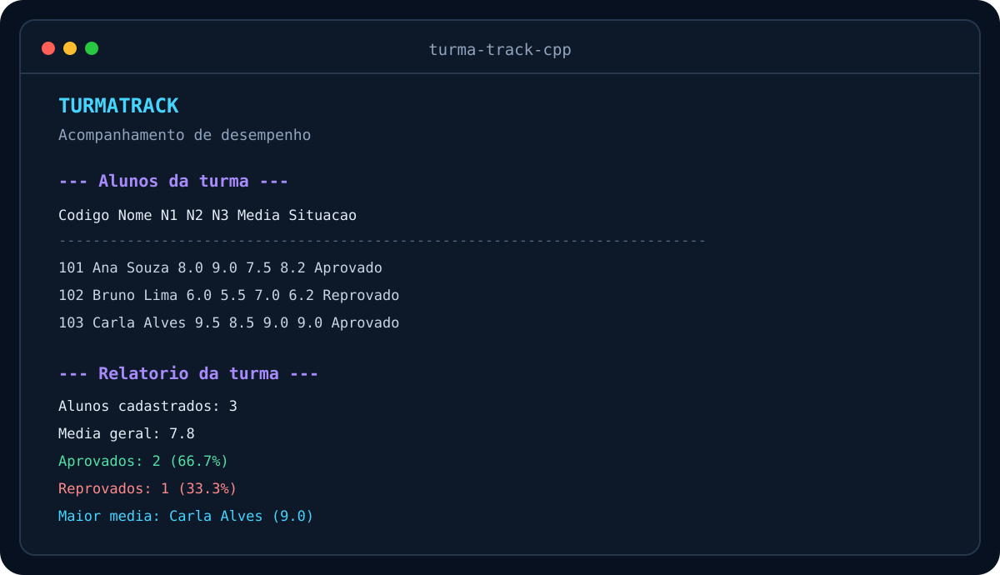

<div align="center">

# TurmaTrack

### Um sistema de terminal para acompanhar o desempenho de uma turma

Projeto desenvolvido em C++ para aplicar, em um único programa, os conteúdos fundamentais estudados na faculdade.

</div>



## Sobre o projeto

O **TurmaTrack** permite cadastrar alunos, registrar três notas por estudante e gerar informações úteis sobre o desempenho da turma. A proposta é transformar conceitos introdutórios de programação em uma aplicação completa, pequena e fácil de explicar.

O programa funciona inteiramente no terminal e mantém os dados apenas durante a execução. Não há banco de dados, arquivos, interface web ou bibliotecas externas.

## Funcionalidades

- Cadastro de alunos com código único e nome.
- Registro e atualização de três avaliações.
- Validação de códigos, opções e notas entre 0 e 10.
- Listagem completa da turma.
- Busca sequencial pelo código do aluno.
- Cálculo da média individual e da situação acadêmica.
- Ranking por média usando Bubble Sort implementado manualmente.
- Visualização da matriz de notas.
- Média geral, maior e menor média.
- Quantidade e percentual de aprovados e reprovados.

## Conteúdos aplicados

| Conteúdo | Aplicação no TurmaTrack |
|---|---|
| Variáveis e operadores | Cálculos de médias e percentuais |
| Condicionais | Validações e situação acadêmica |
| Laços de repetição | Percurso dos alunos e avaliações |
| Funções | Separação das responsabilidades do programa |
| `struct` | Representação dos dados de cada aluno |
| `vector` | Armazenamento dinâmico da turma |
| Matriz | Organização das notas por aluno e avaliação |
| Busca sequencial | Localização de alunos pelo código |
| Bubble Sort | Ordenação decrescente do ranking |

## Estrutura dos dados

Cada aluno é representado por uma `struct` simples:

```cpp
struct Aluno {
    int codigo;
    string nome;
};
```

A turma é armazenada em um `vector<Aluno>`. As notas ficam em uma matriz representada por `vector<vector<double>>`, em que cada linha corresponde a um aluno e cada coluna representa uma avaliação.

```text
                  AVALIACOES
              AV1    AV2    AV3
Aluno 101     8.0    9.0    7.5
Aluno 102     6.0    5.5    7.0
Aluno 103     9.5    8.5    9.0
```

O índice de um aluno no vetor corresponde ao índice de suas notas na matriz.

## Busca sequencial

A busca percorre o vetor desde o primeiro aluno e compara cada código com o valor informado. Quando encontra uma correspondência, retorna o índice do aluno. Caso percorra toda a turma sem encontrar, retorna `-1`.

Essa escolha é adequada para uma aplicação introdutória e permite visualizar claramente o funcionamento de uma busca linear.

## Ordenação do ranking

O ranking utiliza **Bubble Sort** em ordem decrescente. O algoritmo compara duas médias vizinhas e troca suas posições quando a próxima é maior.

Para preservar a ordem original dos cadastros, o programa ordena um vetor de índices. Assim, alunos e notas continuam alinhados na estrutura principal.

## Como executar

É necessário possuir um compilador compatível com C++11 ou superior.

### Linux e macOS

```bash
g++ -std=c++11 -Wall -Wextra -pedantic main.cpp -o turma-track
./turma-track
```

### Windows com MinGW

```powershell
g++ -std=c++11 -Wall -Wextra -pedantic main.cpp -o turma-track.exe
.\turma-track.exe
```

## Exemplo de uso

```text
[1] Cadastrar aluno
[2] Registrar notas
[3] Listar alunos
[4] Buscar aluno
[5] Exibir ranking
[6] Exibir matriz de notas
[7] Exibir relatorio da turma
[0] Encerrar

Escolha uma opcao: 7

--- Relatorio da turma ---
Alunos cadastrados: 3
Alunos com notas completas: 3
Media geral: 7.8
Aprovados: 2 (66.7%)
Reprovados: 1 (33.3%)
Maior media: Carla Alves (9.0)
Menor media: Bruno Lima (6.2)
```

## Organização do programa

```text
turma-track-cpp/
├── .gitignore
├── LICENSE
├── README.md
├── main.cpp
└── turma-track-demo.svg
```

O código foi dividido em funções pequenas para que cada etapa possa ser estudada isoladamente: entrada de dados, validação, cadastro, busca, cálculos, ordenação e relatórios.

## Aprendizados

Este projeto reforçou principalmente:

- a relação entre vetores e matrizes;
- a importância de validar entradas;
- a divisão de um problema em funções menores;
- a implementação manual de busca e ordenação;
- o cuidado necessário para manter dados relacionados na mesma posição;
- a transformação de dados simples em informações úteis.

## Possíveis melhorias futuras

As melhorias abaixo não fazem parte da versão atual, mas podem acompanhar novos conteúdos estudados:

- permitir uma quantidade variável de avaliações;
- editar ou remover alunos;
- salvar os dados após encerrar o programa;
- comparar diferentes algoritmos de ordenação.

## Autor

Desenvolvido por **Eduardo Faé Zanchet**, estudante de Ciência da Computação na Universidade de Passo Fundo.

- [GitHub](https://github.com/EduardoFae210)
- [LinkedIn](https://www.linkedin.com/in/eduardofaezanchet/)

## Licença

Este projeto está disponível sob a licença MIT.
